# Отчет по лабораторной работе №1

## Тема: Математические операции. Переменные и их типы. Операторы. Циклы. Простые условные конструкции. Основы работы со статическими массивами.


---


### Задача 1.2

#### Постановка задачи

Написать простую программу. Ввести два числа с клавиатуры, вычислить их сумму и напечатать результат. Использовать функцию `printf` для приглашений на ввод и для распечатки результата. Использовать функцию `scanf` для ввода каждого числа отдельно с клавиатуры. Для получения доступа к функциям `printf` и `scanf` включить в программу заголовочный файл `stdio.h`. Использовать корректные спецификаторы форматирования. Здесь и далее для распечатки надписей наэкране использовать латинские буквы для избежания проблем с кодировками символов.

#### Математическая модель

$$——$$

#### Список идентификаторов

| Имя переменной | Тип данных | Описание                        |
|----------------|------------|---------------------------------|
| `a`            | int        | Первое введённое число          |
| `b`            | int        | Второе введённое число          |
| `sum`          | int        | Сумма чисел a и b               |

#### Код программы

```c
#include <stdio.h>

int main() {
    int a, b, sum;

    printf("Введите первое число: ");
    scanf("%d", &a);

    printf("Введите второе число: ");
    scanf("%d", &b);

    sum = a + b;

    printf("Сумма чисел: %d\n", sum);

    return 0;
}
```

#### Результат работы программы

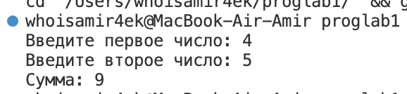


---


### Задача 1.3

#### Постановка задачи

Вычислить значение выражения введя $x$ и $y$ с клавиатуры. Подберите значения аргументов $x$ и $y$ самостоятельно за исключением тривиальных значений. Напечатайте вычисленное значение $u(x, y)$ на экране. Включить в программу заголовочный файл `math.h` для доступа к математическим функциям.

#### Математическая модель

$$u(x, y) = \frac{1 + \sin^2(x + y)}{2 + \left|x - \frac{2x^2}{1 + |\sin(x + y)|}\right|}$$

#### Список идентификаторов

| Имя переменной | Тип данных | Описание                                     |
|---------------|-----------|------------------------------------------------|
| `x`           | double     | Аргумент x                                     |
| `y`           | double     | Аргумент y                                     |
| `u`           | double     | Результат вычисления функции u(x, y)           |

#### Код программы

```c
#include <stdio.h>
#include <math.h>

int main() {
    double x, y, u;
    
    printf("Введите значение x: ");
    scanf("%lf", &x);
    
    printf("Введите значение y: ");
    scanf("%lf", &y);
    
    u = (1 + pow(sin(x + y), 2)) / (2 + fabs(x - (2 * pow(x, 2)) / (1 + fabs(sin(x + y)))) );
    
    printf("Значение u(x, y) = %lf\n", u);
    
    return 0;
}
```

#### Результат работы программы

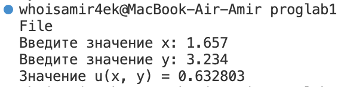


---


### Задача 1.4

#### Постановка задачи

Вычислить значение выраженияВыполнить для следующих значений:

$$a = 0.12, b = 3.5, c = 2.4, x = 1.4;$$ 
$$a = 0.12, b = 3.5, c = 2.4, x = 1.6;$$ 
$$a = 0.27, b = 3.9, c = 2.8, x = 1.8.$$ 

Значения параметров и аргументов можно вводить прямо в коде программы без ввода с клавиатуры.

#### Математическая модель

$$h(x) = - \frac{x - a}{(x^2 + a^2)^{1/3}} - \frac{4 (x^2 + b^2)^{3/4}}{2 + a + b + \frac{(x - c)^2}{3}}$$

#### Список идентификаторов

| Имя переменной| Тип данных| Описание                                     |
|---------------|-----------|----------------------------------------------|
| `x1`          | double    | Входной аргумент функции (1.4)               |
| `x2`          | double    | Входной аргумент функции (1.6)               |
| `x3`          | double    | Входной аргумент функции (1.8)               |
| `a1`          | double    | Параметр a (0.12) для первых двух вычислений |
| `a2`          | double    | Параметр a (0.27) для третьего вычисления    |
| `b1`          | double    | Параметр b (3.5) для первых двух вычислений  |
| `b2`          | double    | Параметр b (3.9) для третьего вычисления     |
| `c1`          | double    | Параметр c (2.4) для первых двух вычислений  |
| `c2`          | double    | Параметр c (2.8) для третьего вычисления     |
| `h1`          | double    | Результат вычисления функции при x = 1.4     |
| `h2`          | double    | Результат вычисления функции при x = 1.6     |
| `h3`          | double    | Результат вычисления функции при x = 1.8     |

#### Код программы

```c
#include <stdio.h>
#include <math.h>

int main() {
    double a1 = 0.12, b1 = 3.5, c1 = 2.4, x1 = 1.4;
    double a2 = 0.12, b2 = 3.5, c2 = 2.4, x2 = 1.6;
    double a3 = 0.27, b3 = 3.9, c3 = 2.8, x3 = 1.8;
    double h1, h2, h3;

    h1 = -(x1 - a1) / pow(x1 * x1 + a1 * a1, 1.0 / 3.0) - (4 * pow(x1 * x1 + b1 * b1, 3.0 / 4.0)) / (2 + a1 + b1 + pow(x1 - c1, 2.0) / 3.0);
    h2 = -(x2 - a2) / pow(x2 * x2 + a2 * a2, 1.0 / 3.0) - (4 * pow(x2 * x2 + b2 * b2, 3.0 / 4.0)) / (2 + a2 + b2 + pow(x2 - c2, 2.0) / 3.0);
    h3 = -(x3 - a3) / pow(x3 * x3 + a3 * a3, 1.0 / 3.0) - (4 * pow(x3 * x3 + b3 * b3, 3.0 / 4.0)) / (2 + a3 + b3 + pow(x3 - c3, 2.0) / 3.0);

    printf("Значение h(x) при x = 1.4: %lf\n", h1);
    printf("Значение h(x) при x = 1.6: %lf\n", h2);
    printf("Значение h(x) при x = 1.8: %lf\n", h3);

    return 0;
}
```

#### Результат работы программы

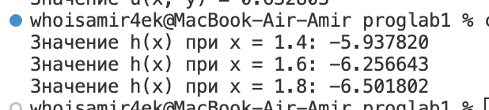


---


### Задача 2.1

#### Постановка задачи

Вычислить используя цикл `for` координаты планеты Марс относительно Земли с течением времени $t$. Распечатать на экране координаты для каждой итерации по $t$. Координаты планеты Марс для каждой итерации задаются заданы формулами, где $r1$ – радиус орбиты Марса, $r2$ – радиус орбиты Земли, $T1$ и $T2$ - периоды обращения указанных планет соответственно, $t$ – каждый заданный момент времени внутри цикла по времени. Подберите подходящие единицы измерения для времени и расстояния.

#### Математическая модель

$$x = r_1 \cos(w_1 t) - r_2 \cos(w_2 t), $$

$$y = r_1 \sin(w_1 t) - r_2 \sin(w_2 t),  $$

$$w_1 = \frac{2\pi}{T_1},  $$

$$w_2 = \frac{2\pi}{T_2}$$

#### Список идентификаторов

| Имя переменной | Тип данных | Описание                                      |
|---------------|-----------|----------------------------------------------|
| `t`           | int       | Текущий момент времени (дискретное значение)  |
| `x`           | double    | Координата Марса по оси X                     |
| `y`           | double    | Координата Марса по оси Y                     |
| `r1`          | double    | Радиус орбиты Марса                           |
| `r2`          | double    | Радиус орбиты Земли                           |
| `T1`          | double    | Период обращения Марса                        |
| `T2`          | double    | Период обращения Земли                        |
| `w1`          | double    | Угловая скорость Марса                        |
| `w2`          | double    | Угловая скорость Земли                        |
| `PI`          | define    | Число π (приближённо 3.141592653589793)       |

#### Код программы

```c
#include <stdio.h>
#include <math.h>

#define PI 3.141592653589793

int main() {
    double r1 = 227.9, r2 = 149.6; 
    double T1 = 687.0, T2 = 365.25; 
    double w1 = 2 * PI / T1, w2 = 2 * PI / T2; 
    double x, y;
    
    for (int t = 0; t <= 10; t++) {
        x = r1 * cos(w1 * t) - r2 * cos(w2 * t);
        y = r1 * sin(w1 * t) - r2 * sin(w2 * t);
        
        printf("Время t = %d лет: координаты Марса (x, y) = (%.2lf, %.2lf)\n", t, x, y);
    }

    return 0;
}
```

#### Результат работы программы

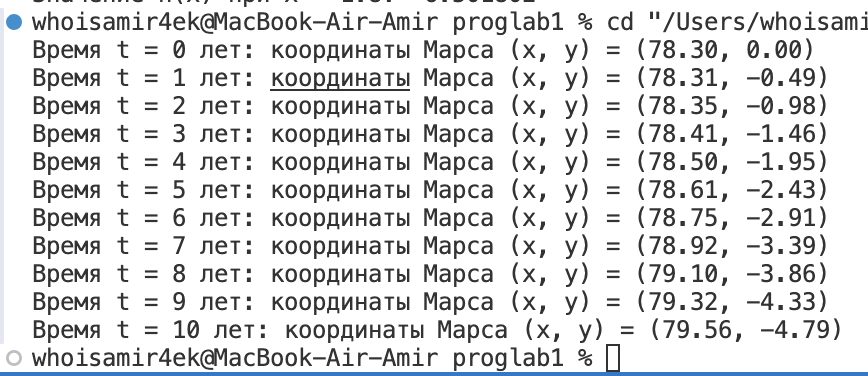


---


### Задача 2.2

#### Постановка задачи

Вычислить определённый интеграл от заданной функции методом трапеций. Функция $f(x)$ может быть выбрана самостоятельно. Результат интегрирования сравнить с вычисленным вручную и убедиться в корректности результата.

#### Математическая модель

$$\int_{a}^{b} f(x) \, dx = \int_{a}^{b} e^{x+2} \, dx$$

#### Список идентификаторов

| Имя переменной  | Тип данных | Описание                                      |
|-----------------|------------|----------------------------------------------|
| `x`             | double     | Входной аргумент функции f(x)                |
| `a`             | double     | Левый предел интегрирования                  |
| `b`             | double     | Правый предел интегрирования                 |
| `n`             | int        | Количество разбиений для метода трапеций     |
| `h`             | double     | Шаг разбиения (расстояние между точками)     |
| `sum`           | double     | Переменная для хранения суммы в методе трапеций |
| `i`             | int        | Индекс в цикле для вычислений суммы          |
| `result`        | double     | Результат численного интегрирования          |
| `f`             | double     | Функция для вычисления значения выражения exp(x + 2) |

#### Код программы

```c
#include <stdio.h>
#include <math.h>

double f(double x) {
    return exp(x + 2);  
}

double trapezoidal_rule(double a, double b, int n) {
    double h = (b - a) / n;
    double sum = (f(a) + f(b)) / 2.0;
    
    for (int i = 1; i < n; i++) {
        sum += f(a + i * h);
    }
    
    return sum * h;
}

int main() {
    double a = 0, b = 1; 
    int n = 1000;    
    
    double result = trapezoidal_rule(a, b, n);
    printf("Результат численного интегрирования методом трапеций: %lf\n", result);
    
    return 0;
}
```

#### Результат работы программы

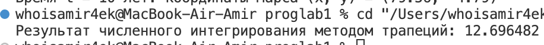


---


### Задача 2.3

#### Постановка задачи

Организовать и распечатать последовательность чисел Падована, непревосходящих число $m$, введенное с клавиатуры. Числа Падована представлены следующим рядом: $1, 1, 1, 2, 2, 3, 4, 5, 7, 9,12, 16, 21, 28, 37, 49, 65, 86, 114, 151, 200, 265, ...$ Использовать конструкцию **for** и простые варианты условной конструкции `if` `else`.

#### Математическая модель

$$P (0) = P (1) = P (2) = 1,   $$
$$P (n) = P (n− 2) + P (n− 3).$$ 

#### Список идентификаторов

| Имя переменной | Тип данных | Описание                                      |
|----------------|------------|----------------------------------------------|
| `m`            | int        | Введённое число m                           |
| `P`            | int[]      | Массив чисел Падована                       |
| `n`            | int        | Индекс для генерации чисел Падована         |

#### Код программы

```c
#include <stdio.h>

int main() {
    int m;

    printf("Введите число m: ");
    scanf("%d", &m);

    int P[100];

    P[0] = 1;
    P[1] = 1;
    P[2] = 1;

    printf("%d ", P[0]);
    if (m >= 1) printf("%d ", P[1]);
    if (m >= 1) printf("%d ", P[2]);

    for (int n = 3; ; n++) {
        P[n] = P[n - 2] + P[n - 3];

        if (P[n] > m) {
            break;
        }

        printf("%d ", P[n]);
    }

    printf("\n");

    return 0;
}
```

#### Результат работы программы

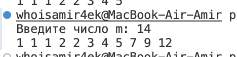


---


### Задача 2.4

#### Постановка задачи

С клавиатуры вводится трёхзначное число, считается сумма его цифр. Если сумма цифр числа больше 10, то вводится следующее трёхзначное число, если сумма меньше либо равна 10 — программа завершается.

#### Математическая модель

$$——$$

#### Список идентификаторов

| Имя переменной | Тип данных | Описание                                     |
|----------------|------------|----------------------------------------------|
| `num`          | int        | Введённое трёхзначное число                  |
| `sum`          | int        | Сумма цифр числа                             |
| `temp`         | int        | Временная переменная для обработки числа     |

#### Код программы

```c
#include <stdio.h>

int main() {
    int num;

    while (1) {
        printf("Введите трёхзначное число: ");
        scanf("%d", &num);

        int sum = 0;
        int temp = num;

        while (temp > 0) {
            sum += temp % 10;
            temp /= 10;
        }

        if (sum <= 10) {
            break;
        }
    }

    return 0;
}
```

#### Результат работы программы

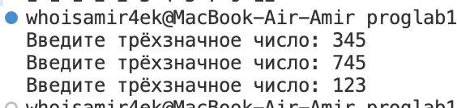


---


### Задача 3.1

#### Постановка задачи

Для некоторого числового вектора $X$, введённого с клавиатуры, вычислить значения вектора $Y = X · X$ $(yi = xi · xi — поэлементно)$.

#### Математическая модель

$$Y = X*X$$

#### Список идентификаторов

| Имя переменной | Тип данных | Описание                                             |
|----------------|------------|------------------------------------------------------|
| `n`            | int        | Размер вектора                                       |
| `X`            | int[]      | Вектор входных данных                                |
| `Y`            | int[]      | Вектор, содержащий элементы X, возведённые в квадрат |
| `i`            | int        | Индекс в цикле для обработки элементов векторов      |

#### Код программы

```c
#include <stdio.h>

int main() {
    int n;

    printf("Введите размер вектора: ");
    scanf("%d", &n);

    int X[n], Y[n];

    printf("Введите элементы вектора X: \n");
    for (int i = 0; i < n; i++) {
        scanf("%d", &X[i]);
    }

    for (int i = 0; i < n; i++) {
        Y[i] = X[i] * X[i];
    }

    printf("Вектор Y = X * X: \n");
    for (int i = 0; i < n; i++) {
        printf("%d ", Y[i]);
    }
    printf("\n");

    return 0;
}
```

#### Результат работы программы

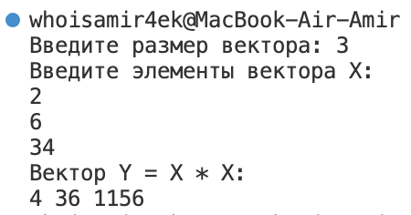


---


### Задача 3.2

#### Постановка задачи

Для некоторого числового массива $X$, введённого с клавиатуры поэлементно, изменить порядок элементов на обратный и распечатать результат на экране.

#### Математическая модель

$$——$$

#### Список идентификаторов

| Имя переменной | Тип данных | Описание                                      |
|----------------|------------|----------------------------------------------|
| `n`            | int        | Размер массива                               |
| `X`            | int[]      | Массив данных, введённый пользователем       |
| `i`            | int        | Индекс в цикле для обработки элементов массива |

#### Код программы

```c
#include <stdio.h>

int main() {
    int n;

    printf("Введите размер массива: ");
    scanf("%d", &n);

    int X[n];

    printf("Введите элементы массива X: \n");
    for (int i = 0; i < n; i++) {
        scanf("%d", &X[i]);
    }

    for (int i = 0; i < n / 2; i++) {
        int temp = X[i];
        X[i] = X[n - i - 1];
        X[n - i - 1] = temp;
    }

    printf("Массив после изменения порядка элементов: \n");
    for (int i = 0; i < n; i++) {
        printf("%d ", X[i]);
    }
    printf("\n");

    return 0;
}
```

#### Результат работы программы

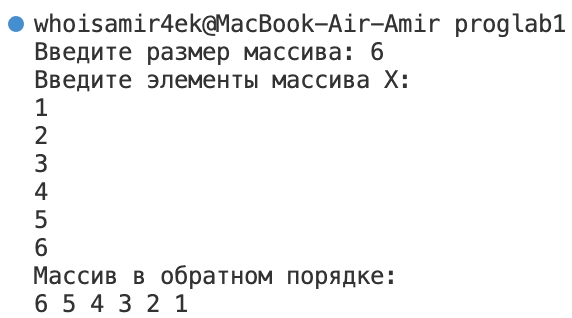


---


### Задача 3.3

#### Постановка задачи

Транспонировать матрицу.

#### Математическая модель

$$——$$

#### Список идентификаторов

| Имя переменной | Тип данных | Описание                                      |
|----------------|------------|----------------------------------------------|
| `A`            | int[3][3]   | Исходная матрица 3x3                         |
| `B`            | int[3][3]   | Транспонированная матрица 3x3                 |
| `i`            | int        | Индекс строки в цикле                        |
| `j`            | int        | Индекс столбца в цикле                       |

#### Код программы

```c
#include <stdio.h>

int main() {
    int A[3][3] = {
        {1, 2, 3},
        {4, 5, 6},
        {7, 8, 9}
    };

    int B[3][3];

    for (int i = 0; i < 3; i++) {
        for (int j = 0; j < 3; j++) {
            B[j][i] = A[i][j];
        }
    }

    printf("Транспонированная матрица:\n");
    for (int i = 0; i < 3; i++) {
        for (int j = 0; j < 3; j++) {
            printf("%d ", B[i][j]);
        }
        printf("\n");
    }

    return 0;
}
```

#### Результат работы программы

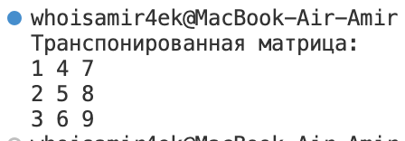


---


### Задача 3.4

#### Постановка задачи

Преобразовать исходную матрицу так, чтобы первый элемент каждой строки был заменён средним арифметическим элементов этой строки.

#### Математическая модель

$$——$$

#### Список идентификаторов

| Имя переменной | Тип данных | Описание                                      |
|----------------|------------|----------------------------------------------|
| `A`            | int[3][3]   | Матрица 3x3, которую нужно преобразовать     |
| `i`            | int        | Индекс строки в цикле                        |
| `j`            | int        | Индекс столбца в цикле                       |
| `sum`          | int        | Сумма элементов в строке матрицы             |
| `avg`          | int        | Среднее арифметическое элементов строки     |

#### Код программы

```c
#include <stdio.h>

int main() {
    int A[3][3] = {
        {1, 2, 3},
        {4, 5, 6},
        {7, 8, 9}
    };

    for (int i = 0; i < 3; i++) {
        int sum = 0;
        for (int j = 0; j < 3; j++) {
            sum += A[i][j];
        }
        int avg = sum / 3;
        A[i][0] = avg;  
    }

    printf("Преобразованная матрица:\n");
    for (int i = 0; i < 3; i++) {
        for (int j = 0; j < 3; j++) {
            printf("%d ", A[i][j]);
        }
        printf("\n");
    }

    return 0;
}
```

#### Результат работы программы

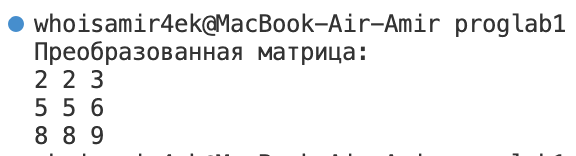


---


### Задача 3.5

#### Постановка задачи

Реализовать самостоятельно алгоритм сортировки вставками (без создания своих функций, внутри функции `main`).

#### Математическая модель

$$——$$

#### Список идентификаторов

| Имя переменной | Тип данных | Описание                                      |
|----------------|------------|----------------------------------------------|
| `n`            | int        | Количество элементов в массиве               |
| `arr`          | int[]      | Массив данных, который нужно отсортировать  |
| `i`            | int        | Индекс в цикле для перебора элементов массива |
| `key`          | int        | Текущий элемент массива, который сравнивается и вставляется на нужную позицию |
| `j`            | int        | Индекс для поиска позиции для вставки элемента |

#### Код программы

```c
#include <stdio.h>

int main() {
    int n;

    printf("Введите количество элементов массива: ");
    scanf("%d", &n);

    int arr[n];

    printf("Введите элементы массива: \n");
    for (int i = 0; i < n; i++) {
        scanf("%d", &arr[i]);
    }

    for (int i = 1; i < n; i++) {
        int key = arr[i];
        int j = i - 1;

        while (j >= 0 && arr[j] > key) {
            arr[j + 1] = arr[j];
            j = j - 1;
        }

        arr[j + 1] = key;
    }

    printf("Отсортированный массив: \n");
    for (int i = 0; i < n; i++) {
        printf("%d ", arr[i]);
    }
    printf("\n");

    return 0;
}
```

#### Результат работы программы

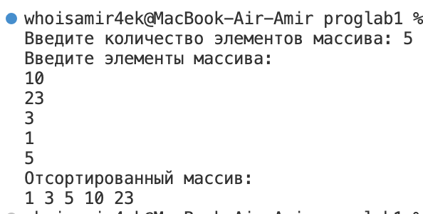


---


## Информация о студенте:

*Аглиуллин Амир, 1 курс, ИВТ-1(2).*
