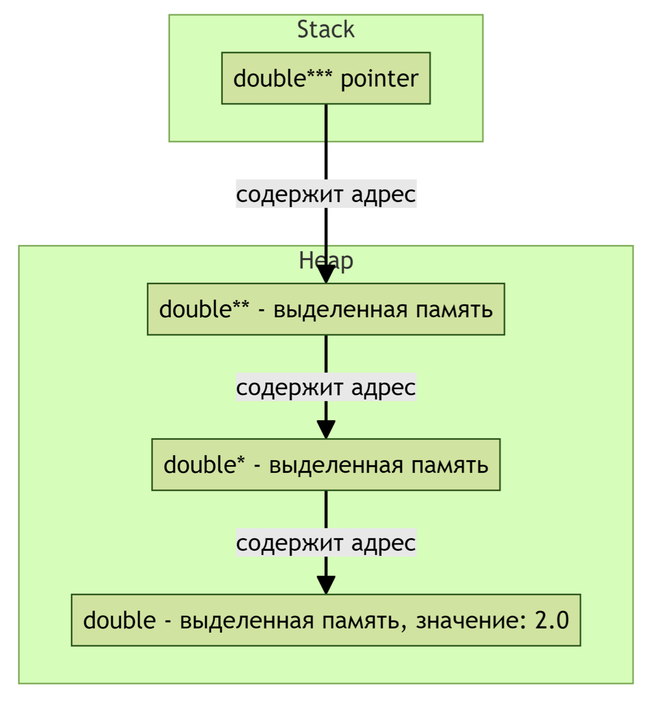

# Отчет по лабораторной работе №2

## Тема: Указатели. Арифметика указателей.

### Задача 1

#### Постановка задачи

Внутри функции `int main(void) { /*...*/ }` определите указатель `double ***pointer = NULL;`. Инициализируйте этот указатель адресом другого указателя типа `double **`, который указывает на переменную `double *`, которая указывает на `double`. Используйте `pointer` для записи и чтения значения `2.0` в сегмент оперативной памяти для `double`. 

Требования:  
- Используйте функции типа `*malloc(...)` для выделения оперативной памяти под динамические объекты `double **`, `double *` и `double`.  
- Запишите и выведите число, указанное в блоке `double` на диаграмме, на экран, используя указатель `double ***pointer = NULL;`.  
- Используйте функцию `free(...)` для освобождения оперативной памяти, выделенной под динамические объекты с применением переменной `pointer`.  
- Запишите всё решение в одну строку одним выражением`(statement)`.

#### Математическая модель



#### Список идентификаторов

| Идентификатор  | Тип данных   | Уровень указателя | Описание                                 |
|----------------|--------------|-------------------|------------------------------------------|
| `pointer`      | `double***`  | Тройной указатель | Главный указатель на указатель на double |
| `*pointer`     | `double**`   | Двойной указатель | Указатель на указатель на double         |
| `**pointer`    | `double*`    | Одинарный указатель | Указатель на значение double           |
| `***pointer`   | `double`     | Значение          | Непосредственно хранимое значение double|

#### Код программы

```c
#include <stdio.h> 
#include <stdlib.h> 
int main() {

    double ***pointer = NULL;

    pointer = malloc(sizeof(double**));
    *pointer = malloc(sizeof(double*)); 
    **pointer = malloc(sizeof(double)); 
    ***pointer = 2.0; 

    printf("%.2lf", ***pointer); 
    
    free(**pointer); 
    free(*pointer); 
    free(pointer);
}
```

#### Результат работы программы


---


### Задача 2

#### Постановка задачи

Сложение двух чисел:  
Напишите программу, которая складывает два числа с использованием указателей на эти числа.

#### Математическая модель

$$sum = *ptr1(num1) + *ptr2(num2)$$

#### Список идентификаторов

| Идентификатор | Тип данных | Описание                          |
|---------------|------------|-----------------------------------|
| `num1`        | `double`   | Первое введённое число           |
| `num2`        | `double`   | Второе введённое число           |
| `sum`         | `double`   | Сумма чисел num1 и num2          |
| `ptr1`        | `double*`  | Указатель на переменную num1     |
| `ptr2`        | `double*`  | Указатель на переменную num2     |

#### Код программы

```c
#include <stdio.h>

int main() {
    double num1, num2, sum;
    double *ptr1 = &num1, *ptr2 = &num2;

    printf("Введите первое число: ");
    scanf("%lf", ptr1);

    printf("Введите второе число: ");
    scanf("%lf", ptr2);

    sum = *ptr1 + *ptr2;

    printf("Сумма чисел: %.2lf\n", sum);

    return 0;
}
```

#### Результат работы программы


---


### Задача 3

#### Постановка задачи

Нахождение максимума из двух чисел:  
Напишите программу, которая находит максимальное число из двух чисел, используя указатели на эти числа.

#### Математическая модель

$$—$$

#### Список идентификаторов

| Идентификатор | Тип данных | Описание                          |
|---------------|------------|-----------------------------------|
| `num1`        | `double`   | Первое введённое число           |
| `num2`        | `double`   | Второе введённое число           |
| `ptr1`        | `double*`  | Указатель на переменную num1     |
| `ptr2`        | `double*`  | Указатель на переменную num2     |

#### Код программы

```c
#include <stdio.h>

int main() {
    double num1, num2;
    double *ptr1 = &num1, *ptr2 = &num2;

    printf("Введите первое число: ");
    scanf("%lf", ptr1);

    printf("Введите второе число: ");
    scanf("%lf", ptr2);

    if (*ptr1 > *ptr2) {
        printf("Максимальное число: %.2lf\n", *ptr1);
    } else {
        printf("Максимальное число: %.2lf\n", *ptr2);
    }

    return 0;
}
```

#### Результат работы программы


---


### Задача 4

#### Постановка задачи

Динамический массив с плавающей точкой:  
Напишите программу, которая создаёт одномерный динамический массив из чисел с плавающей точкой двойной точности, заполняет его значениями с клавиатуры и распечатывает все элементы этого массива, используя арифметику указателей `(оператор+)`, а не оператор доступа к элементу массива `[]`.

#### Математическая модель

$$—$$

#### Список идентификаторов

| Идентификатор | Тип данных | Описание                          |
|---------------|------------|-----------------------------------|
| `n`           | `int`      | Размер динамического массива      |
| `arr`         | `double*`  | Указатель на массив чисел типа double |
| `i`           | `int`      | Счетчик для итераций в циклах     |

#### Код программы

```c
#include <stdio.h>
#include <stdlib.h>

int main() {
    int n;
    double *arr;

    printf("Введите размер массива: ");
    scanf("%d", &n);

    arr = (double *)malloc(n * sizeof(double));
    if (arr == NULL) {
        printf("Ошибка выделения памяти!\n");
        return 1;
    }

    printf("Введите элементы массива:\n");
    for (int i = 0; i < n; i++) {
        scanf("%lf", arr + i);
    }

    printf("Элементы массива:\n");
    for (int i = 0; i < n; i++) {
        printf("%.2lf ", *(arr + i));
    }
    printf("\n");

    free(arr);
    return 0;
}
```

#### Результат работы программы


---


### Задача 2.2

#### Постановка задачи

Вычислить определённый интеграл от заданной функции методом трапеций. Функция $f(x)$ может быть выбрана самостоятельно. Результат интегрирования сравнить с вычисленным вручную и убедиться в корректности результата.

#### Математическая модель

$$\int_{a}^{b} f(x) \, dx = \int_{a}^{b} e^{x+2} \, dx$$

#### Список идентификаторов

| Имя переменной  | Тип данных | Описание                                      |
|-----------------|------------|----------------------------------------------|
| `x`             | double     | Входной аргумент функции f(x)                |
| `a`             | double     | Левый предел интегрирования                  |
| `b`             | double     | Правый предел интегрирования                 |
| `n`             | int        | Количество разбиений для метода трапеций     |
| `h`             | double     | Шаг разбиения (расстояние между точками)     |
| `sum`           | double     | Переменная для хранения суммы в методе трапеций |
| `i`             | int        | Индекс в цикле для вычислений суммы          |
| `result`        | double     | Результат численного интегрирования          |
| `f`             | double     | Функция для вычисления значения выражения exp(x + 2) |

#### Код программы

```c
#include <stdio.h>
#include <math.h>

double f(double x) {
    return exp(x + 2);  
}

double trapezoidal_rule(double a, double b, int n) {
    double h = (b - a) / n;
    double sum = (f(a) + f(b)) / 2.0;
    
    for (int i = 1; i < n; i++) {
        sum += f(a + i * h);
    }
    
    return sum * h;
}

int main() {
    double a = 0, b = 1; 
    int n = 1000;    
    
    double result = trapezoidal_rule(a, b, n);
    printf("Результат численного интегрирования методом трапеций: %lf\n", result);
    
    return 0;
}
```

#### Результат работы программы


---


### Задача 2.3

#### Постановка задачи

Организовать и распечатать последовательность чисел Падована, непревосходящих число $m$, введенное с клавиатуры. Числа Падована представлены следующим рядом: $1, 1, 1, 2, 2, 3, 4, 5, 7, 9,12, 16, 21, 28, 37, 49, 65, 86, 114, 151, 200, 265, ...$ Использовать конструкцию **for** и простые варианты условной конструкции `if` `else`.

#### Математическая модель

$$P (0) = P (1) = P (2) = 1,   $$
$$P (n) = P (n− 2) + P (n− 3).$$ 

#### Список идентификаторов

| Имя переменной | Тип данных | Описание                                      |
|----------------|------------|----------------------------------------------|
| `m`            | int        | Введённое число m                           |
| `P`            | int[]      | Массив чисел Падована                       |
| `n`            | int        | Индекс для генерации чисел Падована         |

#### Код программы

```c
#include <stdio.h>

int main() {
    int m;

    printf("Введите число m: ");
    scanf("%d", &m);

    int P[100];

    P[0] = 1;
    P[1] = 1;
    P[2] = 1;

    printf("%d ", P[0]);
    if (m >= 1) printf("%d ", P[1]);
    if (m >= 1) printf("%d ", P[2]);

    for (int n = 3; ; n++) {
        P[n] = P[n - 2] + P[n - 3];

        if (P[n] > m) {
            break;
        }

        printf("%d ", P[n]);
    }

    printf("\n");

    return 0;
}
```

#### Результат работы программы


---


### Задача 2.4

#### Постановка задачи

С клавиатуры вводится трёхзначное число, считается сумма его цифр. Если сумма цифр числа больше 10, то вводится следующее трёхзначное число, если сумма меньше либо равна 10 — программа завершается.

#### Математическая модель

$$——$$

#### Список идентификаторов

| Имя переменной | Тип данных | Описание                                     |
|----------------|------------|----------------------------------------------|
| `num`          | int        | Введённое трёхзначное число                  |
| `sum`          | int        | Сумма цифр числа                             |
| `temp`         | int        | Временная переменная для обработки числа     |

#### Код программы

```c
#include <stdio.h>

int main() {
    int num;

    while (1) {
        printf("Введите трёхзначное число: ");
        scanf("%d", &num);

        int sum = 0;
        int temp = num;

        while (temp > 0) {
            sum += temp % 10;
            temp /= 10;
        }

        if (sum <= 10) {
            break;
        }
    }

    return 0;
}
```

#### Результат работы программы


---


### Задача 3.1

#### Постановка задачи

Для некоторого числового вектора $X$, введённого с клавиатуры, вычислить значения вектора $Y = X · X$ $(yi = xi · xi — поэлементно)$.

#### Математическая модель

$$Y = X*X$$

#### Список идентификаторов

| Имя переменной | Тип данных | Описание                                             |
|----------------|------------|------------------------------------------------------|
| `n`            | int        | Размер вектора                                       |
| `X`            | int[]      | Вектор входных данных                                |
| `Y`            | int[]      | Вектор, содержащий элементы X, возведённые в квадрат |
| `i`            | int        | Индекс в цикле для обработки элементов векторов      |

#### Код программы

```c
#include <stdio.h>

int main() {
    int n;

    printf("Введите размер вектора: ");
    scanf("%d", &n);

    int X[n], Y[n];

    printf("Введите элементы вектора X: \n");
    for (int i = 0; i < n; i++) {
        scanf("%d", &X[i]);
    }

    for (int i = 0; i < n; i++) {
        Y[i] = X[i] * X[i];
    }

    printf("Вектор Y = X * X: \n");
    for (int i = 0; i < n; i++) {
        printf("%d ", Y[i]);
    }
    printf("\n");

    return 0;
}
```

#### Результат работы программы


---


### Задача 3.2

#### Постановка задачи

Для некоторого числового массива $X$, введённого с клавиатуры поэлементно, изменить порядок элементов на обратный и распечатать результат на экране.

#### Математическая модель

$$——$$

#### Список идентификаторов

| Имя переменной | Тип данных | Описание                                      |
|----------------|------------|----------------------------------------------|
| `n`            | int        | Размер массива                               |
| `X`            | int[]      | Массив данных, введённый пользователем       |
| `i`            | int        | Индекс в цикле для обработки элементов массива |

#### Код программы

```c
#include <stdio.h>

int main() {
    int n;

    printf("Введите размер массива: ");
    scanf("%d", &n);

    int X[n];

    printf("Введите элементы массива X: \n");
    for (int i = 0; i < n; i++) {
        scanf("%d", &X[i]);
    }

    for (int i = 0; i < n / 2; i++) {
        int temp = X[i];
        X[i] = X[n - i - 1];
        X[n - i - 1] = temp;
    }

    printf("Массив после изменения порядка элементов: \n");
    for (int i = 0; i < n; i++) {
        printf("%d ", X[i]);
    }
    printf("\n");

    return 0;
}
```

#### Результат работы программы


---


### Задача 3.3

#### Постановка задачи

Транспонировать матрицу.

#### Математическая модель

$$——$$

#### Список идентификаторов

| Имя переменной | Тип данных | Описание                                      |
|----------------|------------|----------------------------------------------|
| `A`            | int[3][3]   | Исходная матрица 3x3                         |
| `B`            | int[3][3]   | Транспонированная матрица 3x3                 |
| `i`            | int        | Индекс строки в цикле                        |
| `j`            | int        | Индекс столбца в цикле                       |

#### Код программы

```c
#include <stdio.h>

int main() {
    int A[3][3] = {
        {1, 2, 3},
        {4, 5, 6},
        {7, 8, 9}
    };

    int B[3][3];

    for (int i = 0; i < 3; i++) {
        for (int j = 0; j < 3; j++) {
            B[j][i] = A[i][j];
        }
    }

    printf("Транспонированная матрица:\n");
    for (int i = 0; i < 3; i++) {
        for (int j = 0; j < 3; j++) {
            printf("%d ", B[i][j]);
        }
        printf("\n");
    }

    return 0;
}
```

#### Результат работы программы


---


### Задача 3.4

#### Постановка задачи

Преобразовать исходную матрицу так, чтобы первый элемент каждой строки был заменён средним арифметическим элементов этой строки.

#### Математическая модель

$$——$$

#### Список идентификаторов

| Имя переменной | Тип данных | Описание                                      |
|----------------|------------|----------------------------------------------|
| `A`            | int[3][3]   | Матрица 3x3, которую нужно преобразовать     |
| `i`            | int        | Индекс строки в цикле                        |
| `j`            | int        | Индекс столбца в цикле                       |
| `sum`          | int        | Сумма элементов в строке матрицы             |
| `avg`          | int        | Среднее арифметическое элементов строки     |

#### Код программы

```c
#include <stdio.h>

int main() {
    int A[3][3] = {
        {1, 2, 3},
        {4, 5, 6},
        {7, 8, 9}
    };

    for (int i = 0; i < 3; i++) {
        int sum = 0;
        for (int j = 0; j < 3; j++) {
            sum += A[i][j];
        }
        int avg = sum / 3;
        A[i][0] = avg;  
    }

    printf("Преобразованная матрица:\n");
    for (int i = 0; i < 3; i++) {
        for (int j = 0; j < 3; j++) {
            printf("%d ", A[i][j]);
        }
        printf("\n");
    }

    return 0;
}
```

#### Результат работы программы


---


### Задача 3.5

#### Постановка задачи

Реализовать самостоятельно алгоритм сортировки вставками (без создания своих функций, внутри функции `main`).

#### Математическая модель

$$——$$

#### Список идентификаторов

| Имя переменной | Тип данных | Описание                                      |
|----------------|------------|----------------------------------------------|
| `n`            | int        | Количество элементов в массиве               |
| `arr`          | int[]      | Массив данных, который нужно отсортировать  |
| `i`            | int        | Индекс в цикле для перебора элементов массива |
| `key`          | int        | Текущий элемент массива, который сравнивается и вставляется на нужную позицию |
| `j`            | int        | Индекс для поиска позиции для вставки элемента |

#### Код программы

```c
#include <stdio.h>

int main() {
    int n;

    printf("Введите количество элементов массива: ");
    scanf("%d", &n);

    int arr[n];

    printf("Введите элементы массива: \n");
    for (int i = 0; i < n; i++) {
        scanf("%d", &arr[i]);
    }

    for (int i = 1; i < n; i++) {
        int key = arr[i];
        int j = i - 1;

        while (j >= 0 && arr[j] > key) {
            arr[j + 1] = arr[j];
            j = j - 1;
        }

        arr[j + 1] = key;
    }

    printf("Отсортированный массив: \n");
    for (int i = 0; i < n; i++) {
        printf("%d ", arr[i]);
    }
    printf("\n");

    return 0;
}
```

#### Результат работы программы


---


## Информация о студенте:

*Аглиуллин Амир, 1 курс, ИВТ-1(2).*
