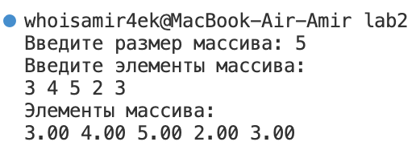
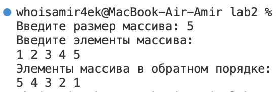
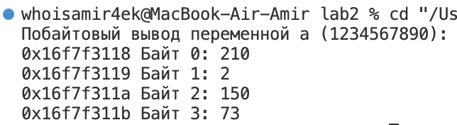
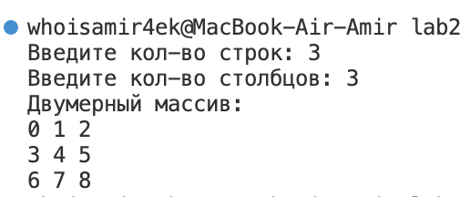

# Отчет по лабораторной работе №2

## Тема: Указатели. Арифметика указателей.

### Задача 1

#### Постановка задачи

Внутри функции `int main(void) { /*...*/ }` определите указатель `double ***pointer = NULL;`. Инициализируйте этот указатель адресом другого указателя типа `double **`, который указывает на переменную `double *`, которая указывает на `double`. Используйте `pointer` для записи и чтения значения `2.0` в сегмент оперативной памяти для `double`. 

Требования:  
- Используйте функции типа `*malloc(...)` для выделения оперативной памяти под динамические объекты `double **`, `double *` и `double`.  
- Запишите и выведите число, указанное в блоке `double` на диаграмме, на экран, используя указатель `double ***pointer = NULL;`.  
- Используйте функцию `free(...)` для освобождения оперативной памяти, выделенной под динамические объекты с применением переменной `pointer`.  
- Запишите всё решение в одну строку одним выражением`(statement)`.

#### Математическая модель


#### Список идентификаторов

| Идентификатор  | Тип данных   | Уровень указателя | Описание                                 |
|----------------|--------------|-------------------|------------------------------------------|
| `pointer`      | `double***`  | Тройной указатель | Главный указатель на указатель на double |
| `*pointer`     | `double**`   | Двойной указатель | Указатель на указатель на double         |
| `**pointer`    | `double*`    | Одинарный указатель | Указатель на значение double           |
| `***pointer`   | `double`     | Значение          | Непосредственно хранимое значение double|

#### Код программы

```c
#include <stdio.h> 
#include <stdlib.h> 
int main() {

    double ***pointer = NULL;

    pointer = malloc(sizeof(double**));
    *pointer = malloc(sizeof(double*)); 
    **pointer = malloc(sizeof(double)); 
    ***pointer = 2.0; 

    printf("%.2lf", ***pointer); 
    
    free(**pointer); 
    free(*pointer); 
    free(pointer);
}
```

#### Результат работы программы


---


### Задача 2

#### Постановка задачи

Сложение двух чисел:  
Напишите программу, которая складывает два числа с использованием указателей на эти числа.

#### Математическая модель

$$sum = *ptr1(num1) + *ptr2(num2)$$

#### Список идентификаторов

| Идентификатор | Тип данных | Описание                          |
|---------------|------------|-----------------------------------|
| `num1`        | `double`   | Первое введённое число           |
| `num2`        | `double`   | Второе введённое число           |
| `sum`         | `double`   | Сумма чисел num1 и num2          |
| `ptr1`        | `double*`  | Указатель на переменную num1     |
| `ptr2`        | `double*`  | Указатель на переменную num2     |

#### Код программы

```c
#include <stdio.h>

int main() {
    double num1, num2, sum;
    double *ptr1 = &num1, *ptr2 = &num2;

    printf("Введите первое число: ");
    scanf("%lf", ptr1);

    printf("Введите второе число: ");
    scanf("%lf", ptr2);

    sum = *ptr1 + *ptr2;

    printf("Сумма чисел: %.2lf\n", sum);

    return 0;
}
```

#### Результат работы программы


---


### Задача 3

#### Постановка задачи

Нахождение максимума из двух чисел:  
Напишите программу, которая находит максимальное число из двух чисел, используя указатели на эти числа.

#### Математическая модель

$$—$$

#### Список идентификаторов

| Идентификатор | Тип данных | Описание                          |
|---------------|------------|-----------------------------------|
| `num1`        | `double`   | Первое введённое число           |
| `num2`        | `double`   | Второе введённое число           |
| `ptr1`        | `double*`  | Указатель на переменную num1     |
| `ptr2`        | `double*`  | Указатель на переменную num2     |

#### Код программы

```c
#include <stdio.h>

int main() {
    double num1, num2;
    double *ptr1 = &num1, *ptr2 = &num2;

    printf("Введите первое число: ");
    scanf("%lf", ptr1);

    printf("Введите второе число: ");
    scanf("%lf", ptr2);

    if (*ptr1 > *ptr2) {
        printf("Максимальное число: %.2lf\n", *ptr1);
    } else {
        printf("Максимальное число: %.2lf\n", *ptr2);
    }

    return 0;
}
```

#### Результат работы программы


---


### Задача 4

#### Постановка задачи

Динамический массив с плавающей точкой:  
Напишите программу, которая создаёт одномерный динамический массив из чисел с плавающей точкой двойной точности, заполняет его значениями с клавиатуры и распечатывает все элементы этого массива, используя арифметику указателей (`оператор+`), а не оператор доступа к элементу массива `[]`.

#### Математическая модель

$$—$$

#### Список идентификаторов

| Идентификатор | Тип данных | Описание                          |
|---------------|------------|-----------------------------------|
| `n`           | `int`      | Размер динамического массива      |
| `arr`         | `double*`  | Указатель на массив чисел типа double |
| `i`           | `int`      | Счетчик для итераций в циклах     |

#### Код программы

```c
#include <stdio.h>
#include <stdlib.h>

int main() {
    int n;
    double *arr;

    printf("Введите размер массива: ");
    scanf("%d", &n);

    arr = (double *)malloc(n * sizeof(double));
    if (arr == NULL) {
        printf("Ошибка выделения памяти!\n");
        return 1;
    }

    printf("Введите элементы массива:\n");
    for (int i = 0; i < n; i++) {
        scanf("%lf", arr + i);
    }

    printf("Элементы массива:\n");
    for (int i = 0; i < n; i++) {
        printf("%.2lf ", *(arr + i));
    }
    printf("\n");

    free(arr);
    return 0;
}
```

#### Результат работы программы




---


### Задача 5

#### Постановка задачи

Обратный порядок элементов массива:  
Выведите элементы динамического массива целых чисел в обратном порядке, используя указатель и операцию декремента (`--`).

#### Математическая модель

$$—$

#### Список идентификаторов

| Идентификатор | Тип данных | Описание                          |
|---------------|------------|-----------------------------------|
| `n`           | `int`      | Размер массива                    |
| `arr`         | `int*`     | Указатель на массив               |
| `i`           | `int`      | Счетчик циклов                    | 
| `ptr`         | `int*`     | Указатель для обратного обхода    |

#### Код программы

```c
#include <stdio.h>
#include <stdlib.h>

int main() {
    int n;
    int *arr;

    printf("Введите размер массива: ");
    scanf("%d", &n);

    arr = (int *)malloc(n * sizeof(int));
    if (arr == NULL) {
        printf("Ошибка выделения памяти!\n");
        return 1;
    }

    printf("Введите элементы массива:\n");
    for (int i = 0; i < n; i++) {
        scanf("%d", &arr[i]);
    }

    printf("Элементы массива в обратном порядке:\n");
    int *ptr = arr + n - 1;
    for (int i = 0; i < n; i++) {
        printf("%d ", *ptr);
        ptr--;
    }
    printf("\n");

    free(arr);
    return 0;
}
```

#### Результат работы программы




---


### Задача 6

#### Постановка задачи

Побайтовый вывод переменной:  
Определите переменную целого типа `int a = 1234567890;` и выведите побайтово её содержимое на экран, используя указатель `char *`.

#### Математическая модель

$$—$$

#### Список идентификаторов

| Идентификатор | Тип данных       | Описание                     |
|---------------|------------------|------------------------------|
| `a`           | `int`            | Исходное целое число         |
| `bptr`        | `unsigned char*` | Указатель для побайтового доступа |
| `i`           | `int`            | Счетчик байтов               |

#### Код программы

```c
#include <stdio.h>

int main() {
    int a = 1234567890;
    unsigned char * bptr = (unsigned char *)&a;
    printf("Побайтовый вывод переменной a (%d):\n", a);
    for (int i = 0; i < sizeof(a); i++) {
        printf("%p Байт %d: %d\n", bptr + i, i, *(bptr + i));
    }
}
```

#### Результат работы программы




---


### Задача 7

#### Постановка задачи

Двумерный динамический массив:  
Выделите память под двумерный динамический массив, используя массив указателей на строки (см. лекции), а затем корректно освободите оперативную память.

#### Математическая модель

$$——$$

#### Список идентификаторов

| Идентификатор | Тип данных | Описание                     |
|---------------|------------|------------------------------|
| `rows`        | `int`      | Количество строк массива     |
| `cols`        | `int`      | Количество столбцов массива  |
| `array`       | `int**`    | Двойной указатель на массив  |
| `i`           | `int`      | Счетчик строк                |
| `j`           | `int`      | Счетчик столбцов             |

#### Код программы

```c
#include <stdio.h>
#include <stdlib.h>

int main() {
    int rows, cols;
    int **array;

    printf("Введите кол-во строк: ");
    scanf("%d", &rows);
    
    printf("Введите кол-во столбцов: ");
    scanf("%d", &cols);

    array = (int **)malloc(rows * sizeof(int *));
    if (array == NULL) {
        printf("\nОшибка выделения памяти\n");
        return 1;
    }

    for (int i = 0; i < rows; i++) {
        array[i] = (int *)malloc(cols * sizeof(int));
        if (array[i] == NULL) {
            printf("Ошибка выделения памяти\n");
            
            for (int j = 0; j < i; j++) {
                free(array[j]);
            }
            free(array);
            return 1;
        }
    }

    for (int i = 0; i < rows; i++) {
        for (int j = 0; j < cols; j++) {
            array[i][j] = i * cols + j;
        }
    }

    printf("Двумерный массив:\n");
    for (int i = 0; i < rows; i++) {
        for (int j = 0; j < cols; j++) {
            printf("%d ", array[i][j]);
        }
        printf("\n");
    }

    for (int i = 0; i < rows; i++) {
        free(array[i]);
    }
    free(array);

    return 0;
}
```

#### Результат работы программы




---


## Информация о студенте:

*Аглиуллин Амир, 1 курс, ИВТ-1(2).*
