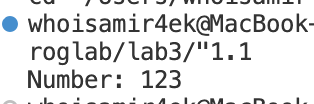
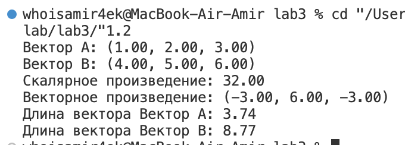
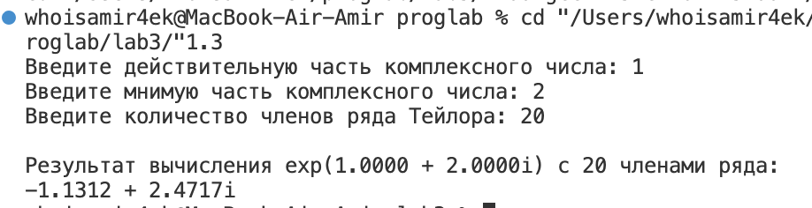
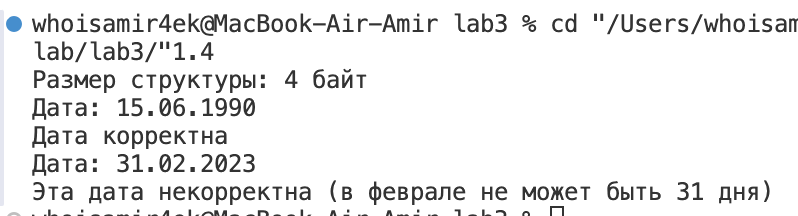
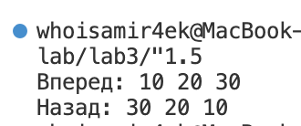
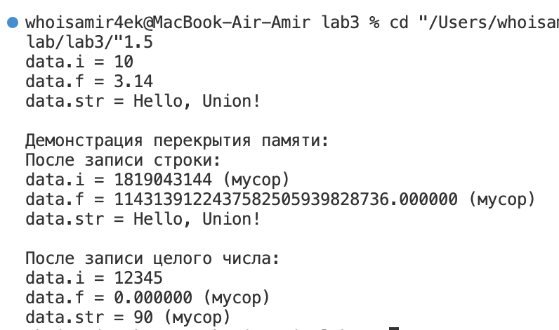
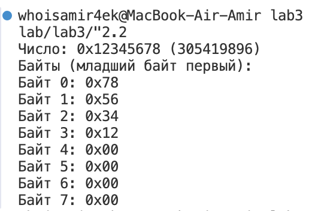
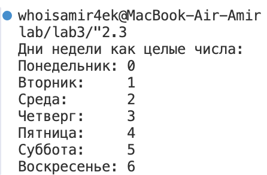
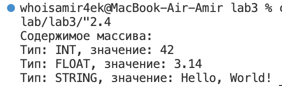

# Отчет по лабораторной работе №3

## Тема: Структуры. Объединения. Перечисления.

---

### Комплект 1: Структуры

#### Задача 1.1: Указатель на функцию в структуре

**Постановка задачи:**  
Создать структуру с указателем на функцию в качестве поля. Вызвать эту функцию через имя переменной этой структуры и поле указателя на функцию.

**Список идентификаторов:**  
| Идентификатор | Тип данных | Описание |
|---------------|------------|----------|
| `MyStruct`    | `struct`   | Структура с указателем на функцию |
| `function`    | `void (*)(int)` | Указатель на функцию, принимающую `int` |
| `print_number` | `void (int)` | Функция для вывода числа |

**Код программы:**
```c
#include <stdio.h>

struct MyStruct {
    void (*function)(int);
};

void print_number(int num) {
    printf("Number: %d\n", num);
}

int main() {
    struct MyStruct my_instance;
    my_instance.function = print_number;
    
    my_instance.function(123);
    
    return 0;
}
```

**Результат работы программы:**


---

#### Задача 1.2: Операции над 3D-векторами

**Постановка задачи:**  
## Описание задачи
Создать структуру для вектора в 3-х мерном пространстве и реализовать операции:
- Скалярное умножение векторов
- Векторное произведение
- Вычисление модуля вектора
- Вывод вектора в консоль  

Структура должна содержать имя вектора как отдельное поле.

**Список идентификаторов:**  
| Идентификатор | Тип данных | Описание |
|---------------|------------|----------|
| `Vector3D`    | `struct`   | Структура для 3D-вектора |
| `dot_product` | `double`   | Функция скалярного произведения |
| `cross_product` | `Vector3D` | Функция векторного произведения |
| `vector_length` | `double`   | Функция вычисления длины вектора |
| `print_vector` | `void`     | Функция вывода вектора |

**Код программы:**
```c
#include <stdio.h>
#include <math.h>
#include <string.h>

// Структура для 3D-вектора
typedef struct {
    char name[50];  // Имя вектора
    double x, y, z; // Координаты
} Vector3D;

// Скалярное произведение векторов
double dot_product(Vector3D a, Vector3D b) {
    return a.x * b.x + a.y * b.y + a.z * b.z;
}

// Векторное произведение векторов
Vector3D cross_product(Vector3D a, Vector3D b) {
    Vector3D result;
    strcpy(result.name, "Векторное произведение");
    result.x = a.y * b.z - a.z * b.y;
    result.y = a.z * b.x - a.x * b.z;
    result.z = a.x * b.y - a.y * b.x;
    return result;
}

// Модуль (длина) вектора
double vector_length(Vector3D v) {
    return sqrt(v.x * v.x + v.y * v.y + v.z * v.z);
}

// Печать вектора
void print_vector(Vector3D v) {
    printf("%s: (%.2f, %.2f, %.2f)\n", v.name, v.x, v.y, v.z);
}

int main() {
    // Создаем векторы
    Vector3D v1 = {"Вектор A", 1.0, 2.0, 3.0};
    Vector3D v2 = {"Вектор B", 4.0, 5.0, 6.0};
    
    // Печатаем векторы
    print_vector(v1);
    print_vector(v2);
    
    // Скалярное произведение
    double dot = dot_product(v1, v2);
    printf("Скалярное произведение: %.2f\n", dot);
    
    // Векторное произведение
    Vector3D cross = cross_product(v1, v2);
    print_vector(cross);
    
    // Модули векторов
    printf("Длина вектора %s: %.2f\n", v1.name, vector_length(v1));
    printf("Длина вектора %s: %.2f\n", v2.name, vector_length(v2));
    
    return 0;
}
```

**Результат работы программы:**


---

#### Задача 1.3: Комплексная экспонента

**Постановка задачи:**  
Требуется вычислить комплексную экспоненту $( \exp(z) )$ для заданного комплексного числа $( z \in \mathbb{C} )$, используя структуру для представления комплексных чисел. 

Ряд Тейлора для комплексной экспоненты:  

$$exp(z) = 1 + z + \frac{1}{2!}z^2 + \frac{1}{3!}z^3 + \ldots + \frac{1}{n!}z^nx$$

**Список идентификаторов:**  
| Идентификатор | Тип данных | Описание |
|---------------|------------|----------|
| `Complex`     | `struct`   | Структура комплексного числа |
| `complex_exp` | `Complex`  | Функция вычисления экспоненты |
| `print_complex` | `void`    | Функция вывода комплексного числа |

**Код программы:**
```c
#include <stdio.h>
#include <math.h>

// Структура для представления комплексного числа
typedef struct {
    double real;    // действительная часть
    double imag;    // мнимая часть
} Complex;

// Функция сложения комплексных чисел
Complex add(Complex a, Complex b) {
    Complex result;
    result.real = a.real + b.real;
    result.imag = a.imag + b.imag;
    return result;
}

// Функция умножения комплексных чисел
Complex multiply(Complex a, Complex b) {
    Complex result;
    result.real = a.real * b.real - a.imag * b.imag;
    result.imag = a.real * b.imag + a.imag * b.real;
    return result;
}

// Функция деления комплексного числа на вещественное
Complex divide_by_scalar(Complex a, double scalar) {
    Complex result;
    result.real = a.real / scalar;
    result.imag = a.imag / scalar;
    return result;
}

// Функция вычисления факториала
double factorial(int n) {
    if (n == 0) return 1.0;
    double result = 1.0;
    for (int i = 2; i <= n; i++) {
        result *= i;
    }
    return result;
}

// Функция вычисления комплексной экспоненты (ряд Тейлора)
Complex complex_exp(Complex z, int terms) {
    Complex result = {1.0, 0.0};  // Начальное значение (первый член ряда)
    Complex current_term = {1.0, 0.0};  // Текущий член ряда (z^n/n!)
    
    for (int n = 1; n <= terms; n++) {
        current_term = multiply(current_term, z);  // Умножаем на z для получения z^n
        current_term = divide_by_scalar(current_term, n);  // Делим на n для получения z^n/n!
        result = add(result, current_term);  // Добавляем к результату
    }
    
    return result;
}

// Функция вывода комплексного числа
void print_complex(Complex z) {
    if (z.imag >= 0) {
        printf("%.4f + %.4fi", z.real, z.imag);
    } else {
        printf("%.4f - %.4fi", z.real, -z.imag);
    }
}

int main() {
    Complex z;
    int terms;
    
    printf("Введите действительную часть комплексного числа: ");
    scanf("%lf", &z.real);
    
    printf("Введите мнимую часть комплексного числа: ");
    scanf("%lf", &z.imag);
    
    printf("Введите количество членов ряда Тейлора: ");
    scanf("%d", &terms);
    
    Complex exp_z = complex_exp(z, terms);
    
    printf("\nРезультат вычисления exp(");
    print_complex(z);
    printf(") с %d членами ряда:\n", terms);
    print_complex(exp_z);
    printf("\n");
    
    return 0;
}

```

**Результат работы программы:**


---

#### Задача 1.4: Битовые поля для даты

**Постановка задачи:**  
Используя "битовые поля" в структуре C, создать экономичную структуру данных в оперативной памяти для хранения даты какого-либо события, например, даты рождения человека.

**Список идентификаторов:**  
| Идентификатор | Тип данных | Описание |
|---------------|------------|----------|
| `CompactDate` | `struct`   | Структура с битовыми полями |
| `print_date`  | `void`     | Функция вывода даты |
| `is_date_valid` | `int`    | Функция проверки корректности даты |

**Код программы:**
```c
#include <stdio.h>
#include <stdint.h>

// Структура для хранения даты с битовыми полями
typedef struct {
    unsigned int day : 5;    // 5 бит (до 31)
    unsigned int month : 4;  // 4 бита (до 15, нам нужно до 12)
    unsigned int year : 12;  // 12 бит (до 4095, достаточно для годов 0-4095)
} CompactDate;

// Функция для вывода даты
void print_date(const CompactDate* date) {
    printf("Дата: %02u.%02u.%04u\n", date->day, date->month, date->year);
}

// Функция для проверки корректности даты
int is_date_valid(const CompactDate* date) {
    if (date->month == 0 || date->month > 12) return 0;
    if (date->day == 0) return 0;
    
    // Проверка количества дней в месяце
    int days_in_month;
    switch (date->month) {
        case 2:
            // Простой способ проверки високосного года
            days_in_month = ((date->year % 4 == 0 && date->year % 100 != 0) || date->year % 400 == 0) ? 29 : 28;
            break;
        case 4: case 6: case 9: case 11:
            days_in_month = 30;
            break;
        default:
            days_in_month = 31;
    }
    
    return date->day <= days_in_month;
}

int main() {
    CompactDate birthday = {15, 6, 1990};  // 15.06.1990
    
    printf("Размер структуры: %zu байт\n", sizeof(CompactDate));
    print_date(&birthday);
    
    if (is_date_valid(&birthday)) {
        printf("Дата корректна\n");
    } else {
        printf("Дата некорректна\n");
    }
    
    // Пример с некорректной датой
    CompactDate invalid = {31, 2, 2023};
    print_date(&invalid);
    if (!is_date_valid(&invalid)) {
        printf("Эта дата некорректна (в феврале не может быть 31 дня)\n");
    }
    
    return 0;
}
```

**Результат работы программы:**


---

#### Задача 1.5: Двунаправленный связный список

**Постановка задачи:**  
Реализовать в виде структур двунаправленный связный список и совершить отдельно его обход в прямом и обратном направлениях с распечаткой значений каждого элемента списка.

**Список идентификаторов:**  
| Идентификатор | Тип данных | Описание |
|---------------|------------|----------|
| `Node`        | `struct`   | Элемент списка |
| `add`         | `void`     | Функция добавления элемента |
| `print_forward` | `void`   | Функция обхода вперед |
| `print_backward` | `void`  | Функция обхода назад |

**Код программы:**
```c
#include <stdio.h>
#include <stdlib.h>

// Элемент списка
struct Node {
    int value;          // Значение
    struct Node* prev;  // Предыдущий элемент
    struct Node* next;  // Следующий элемент
};

// Создать новый элемент
struct Node* create(int val) {
    struct Node* n = malloc(sizeof(struct Node));
    n->value = val;
    n->prev = n->next = NULL;
    return n;
}

// Добавить в конец списка
void add(struct Node** head, struct Node** tail, int val) {
    struct Node* n = create(val);
    
    if (*head == NULL) {
        *head = *tail = n;
    } else {
        (*tail)->next = n;
        n->prev = *tail;
        *tail = n;
    }
}

// Печать списка вперед
void print_forward(struct Node* head) {
    printf("Вперед: ");
    while (head) {
        printf("%d ", head->value);
        head = head->next;
    }
    printf("\n");
}

// Печать списка назад
void print_backward(struct Node* tail) {
    printf("Назад: ");
    while (tail) {
        printf("%d ", tail->value);
        tail = tail->prev;
    }
    printf("\n");
}

// Очистить память
void clear(struct Node* head) {
    while (head) {
        struct Node* t = head;
        head = head->next;
        free(t);
    }
}

int main() {
    struct Node *head = NULL, *tail = NULL;
    
    add(&head, &tail, 10);
    add(&head, &tail, 20);
    add(&head, &tail, 30);
    
    print_forward(head);
    print_backward(tail);
    
    clear(head);
    return 0;
}
```

**Результат работы программы:**


---

### Комплект 2: Объединения и перечисления

#### Задача 2.1: Указатель на объединение

**Постановка задачи:**  
Написать программу, которая использует указатель на некоторое объединение `union`.

**Список идентификаторов:**  
| Идентификатор | Тип данных | Описание |
|---------------|------------|----------|
| `Data`        | `union`    | Объединение для разных типов данных |
| `ptr`         | `Data*`    | Указатель на объединение |

**Код программы:**
```c
#include <stdio.h>
#include <string.h>

// Объединение для хранения разных типов данных
union Data {
    int i;
    float f;
    char str[20];
};

int main() {
    union Data data;          // Объявляем объединение
    union Data *ptr = &data;  // Указатель на объединение

    // Работа с целым числом через указатель
    ptr->i = 10;
    printf("data.i = %d\n", ptr->i);

    // Работа с вещественным числом через указатель
    ptr->f = 3.14;
    printf("data.f = %.2f\n", ptr->f);

    // Работа со строкой через указатель
    strcpy(ptr->str, "Hello, Union!");
    printf("data.str = %s\n", ptr->str);

    // Демонстрация перекрытия памяти
    printf("\nДемонстрация перекрытия памяти:\n");
    printf("После записи строки:\n");
    printf("data.i = %d (мусор)\n", ptr->i);
    printf("data.f = %f (мусор)\n", ptr->f);
    printf("data.str = %s\n\n", ptr->str);

    // Восстановим целое число
    ptr->i = 12345;
    printf("После записи целого числа:\n");
    printf("data.i = %d\n", ptr->i);
    printf("data.f = %f (мусор)\n", ptr->f);
    printf("data.str = %s (мусор)\n", ptr->str);

    return 0;
}
```

**Результат работы программы:**


---

#### Задача 2.2: Побайтовая распечатка числа

**Постановка задачи:**  
Написать программу, которая использует `union` для побайтовой распечатки типа `unsigned long`.

**Список идентификаторов:**  
| Идентификатор | Тип данных | Описание |
|---------------|------------|----------|
| `LongBytes`   | `union`    | Объединение для доступа к байтам числа |
| `bytes`       | `unsigned char[]` | Массив байтов числа |

**Код программы:**
```c
#include <stdio.h>

// Объединение для доступа к отдельным байтам числа
union LongBytes {
    unsigned long number;  // Целое число (обычно 4 или 8 байт)
    unsigned char bytes[sizeof(unsigned long)];  // Массив байтов
};

int main() {
    union LongBytes lb;
    lb.number = 0x12345678;  // Пример числа для анализа
    
    printf("Число: 0x%lx (%lu)\n", lb.number, lb.number);
    printf("Байты (младший байт первый):\n");
    
    // Печатаем каждый байт отдельно
    for (size_t i = 0; i < sizeof(unsigned long); i++) {
        printf("Байт %zu: 0x%02x\n", i, lb.bytes[i]);
    }
    
    return 0;
}
```

**Результат работы программы:**


---

#### Задача 2.3: Перечисление дней недели

**Постановка задачи:**  
Создать перечислимый тип данных `enum` для семи дней недели и распечатайте на экран его значения, как целые числа

**Список идентификаторов:**  
| Идентификатор | Тип данных | Описание |
|---------------|------------|----------|
| `WeekDays`    | `enum`     | Перечисление дней недели |

**Код программы:**
```c
#include <stdio.h>

// Определение перечислимого типа для дней недели
enum WeekDays {
    MONDAY,    // 0
    TUESDAY,   // 1
    WEDNESDAY, // 2
    THURSDAY,  // 3
    FRIDAY,    // 4
    SATURDAY,  // 5
    SUNDAY     // 6
};

int main() {
    // Печать всех значений перечисления как целых чисел
    printf("Дни недели как целые числа:\n");
    printf("Понедельник: %d\n", MONDAY);
    printf("Вторник:     %d\n", TUESDAY);
    printf("Среда:       %d\n", WEDNESDAY);
    printf("Четверг:     %d\n", THURSDAY);
    printf("Пятница:     %d\n", FRIDAY);
    printf("Суббота:     %d\n", SATURDAY);
    printf("Воскресенье: %d\n", SUNDAY);

    return 0;
}
```

**Результат работы программы:**


---

#### Задача 2.4: Размеченное объединение

**Постановка задачи:**  
Создайте так называемое размеченное объединение `union`, которое заключено в виде поля структуры `struct` вместе с ещё одним полем, которое является перечислением `enum` и служит индикатором того, что именно на текущий момент хранится в таком вложенном объединении. Создать и заполнить динамический массив таких структур с объединениями внутри, заполняя вспомогательное поле перечисления `enum` для сохранения информации о хранимом в каждом размеченном объединении типе данных. Реализовать распечатку данных массива таких структур в консоль.

**Список идентификаторов:**  
| Идентификатор | Тип данных | Описание |
|---------------|------------|----------|
| `TaggedUnion` | `struct`   | Структура с размеченным объединением |
| `DataType`    | `enum`     | Перечисление для указания типа данных |

**Код программы:**
```c
#include <stdio.h>
#include <stdlib.h>
#include <string.h>

// Перечисление для указания типа данных в объединении
enum DataType { INT, FLOAT, STRING };

// Размеченное объединение
typedef struct {
    enum DataType type;  // Тэг - указывает тип данных
    union {
        int i;
        float f;
        char s[20];
    } data;  // Само объединение с разными типами данных
} TaggedUnion;

// Функция для печати элемента
void print_tagged_union(const TaggedUnion* tu) {
    switch (tu->type) {
        case INT:
            printf("Тип: INT, значение: %d\n", tu->data.i);
            break;
        case FLOAT:
            printf("Тип: FLOAT, значение: %.2f\n", tu->data.f);
            break;
        case STRING:
            printf("Тип: STRING, значение: %s\n", tu->data.s);
            break;
        default:
            printf("Неизвестный тип данных\n");
    }
}

int main() {
    // Создаем динамический массив из 3 элементов
    TaggedUnion* array = malloc(3 * sizeof(TaggedUnion));
    if (!array) {
        perror("Ошибка выделения памяти");
        return 1;
    }

    // Заполняем массив разными типами данных
    array[0].type = INT;
    array[0].data.i = 42;

    array[1].type = FLOAT;
    array[1].data.f = 3.14159f;

    array[2].type = STRING;
    strncpy(array[2].data.s, "Hello, World!", sizeof(array[2].data.s));

    // Печатаем содержимое массива
    printf("Содержимое массива:\n");
    for (int i = 0; i < 3; i++) {
        print_tagged_union(&array[i]);
    }

    // Освобождаем память
    free(array);

    return 0;
}
```

**Результат работы программы:**


---

## Информация о студенте:

*Аглиуллин Амир, 1 курс, ИВТ-1(2).*
