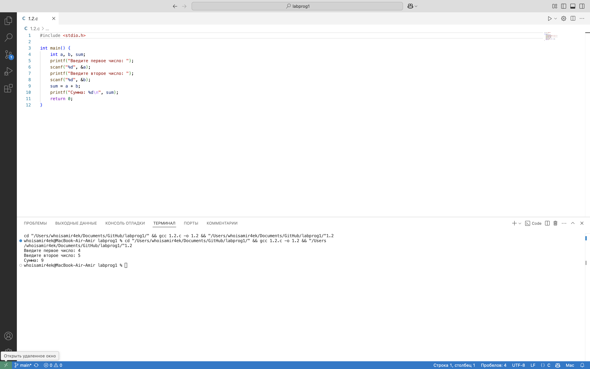

# Отчет по лабораторной работе №1

## Тема: Математические операции. Переменные и их типы. Операторы. Циклы. Простые условные конструкции. Основы работы со статическими массивами.

### Задача 1.2

#### Постановка задачи

Написать простую программу. Ввести два числа с клавиатуры, вычислить их сумму и напечатать результат. Использовать функцию printf для приглашений на ввод и для распечатки результата. Использовать функцию scanf для ввода каждого числа отдельно с клавиатуры. Для получения доступа к функциям printf и scanf включить в программу заголовочный файл stdio.h. Использовать корректные спецификаторы форматирования. Здесь и далее для распечатки надписей наэкране использовать латинские буквы для избежания проблем с кодировками символов.

#### Математическая модель

——

#### Список идентификаторов

| Имя переменной | Тип данных | Описание                        |
|----------------|------------|---------------------------------|
| `a`            | int        | Первое введённое число          |
| `b`            | int        | Второе введённое число          |
| `sum`          | int        | Сумма чисел a и b               |

#### Код программы

```c
#include <stdio.h>

int main() {
    int a, b, sum;

    printf("Введите первое число: ");
    scanf("%d", &a);

    printf("Введите второе число: ");
    scanf("%d", &b);

    sum = a + b;

    printf("Сумма чисел: %d\n", sum);

    return 0;
}
```

#### Результат работы программы



### Задача 1.3

#### Постановка задачи

Вычислить значение выражения введя x и y с клавиатуры. Подберите значения аргументов x и y самостоятельно за исключением тривиальных значений. Напечатайте вычисленное значение u(x, y) на экране. Включить в программу заголовочный файл math.h для доступа к математическим функциям.

#### Математическая модель

*u(x, y) = (1 + sin^2(x + y)) / (2 + |x - (2 * x^2) / (1 + |sin(x + y)|))* 

#### Список идентификаторов

| Имя переменной | Тип данных | Описание                                     |
|---------------|-----------|------------------------------------------------|
| `x`           | float     | Аргумент x                                     |
| `y`           | float     | Аргумент y                                     |
| `u`           | float     | Результат вычисления функции u(x, y)           |

#### Код программы

```c
#include <stdio.h>
#include <math.h>

int main() {
    double x, y, u;
    
    printf("Введите значение x: ");
    scanf("%lf", &x);
    
    printf("Введите значение y: ");
    scanf("%lf", &y);
    
    u = (1 + pow(sin(x + y), 2)) / (2 + fabs(x - (2 * pow(x, 2)) / (1 + fabs(sin(x + y)))) );
    
    printf("Значение u(x, y) = %lf\n", u);
    
    return 0;
}
```

#### Результат работы программы


